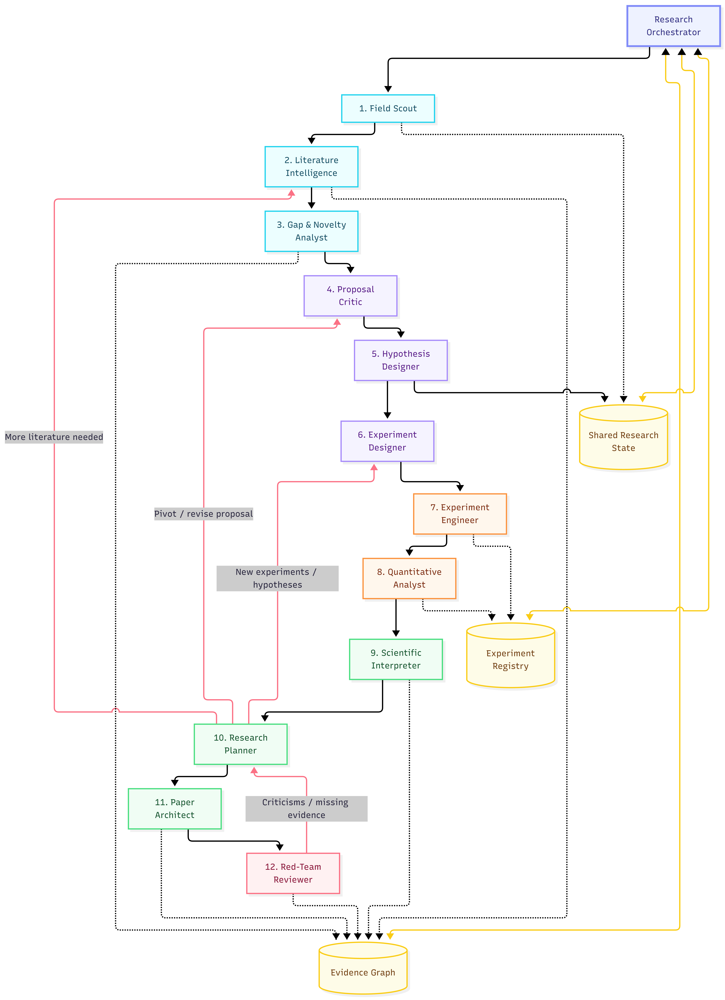

# Research Pilot

Research Pilot takes a research idea to a tested, evidence-mapped manuscript. Twelve specialised agents work on one shared research state (literature base, evidence graph, hypothesis and experiment registries, decision log, adaptive roadmap) under a control-plane orchestrator. The loop does not stop at the first draft: results feed back into planning, and a red-team reviewer's objections send the work back for more literature, new experiments, revised hypotheses or a pivot.

Model calls are **routed by task difficulty, not by agent**. Searching, extraction and summaries run on a lite model at low reasoning effort; novelty judgments, critique, hypothesis and experiment design, interpretation, planning and review run on a strong model at high effort; experiment code goes to a coding tier; deduplication, citation graphs, statistics and citation formatting are plain code.



## How a project runs

1. **Field map.** The Field Scout maps subfields, methods, datasets, metrics and open questions.
2. **Literature.** Literature Intelligence searches OpenAlex and arXiv (Semantic Scholar optional), follows citation chains, extracts every paper and clusters methods. The Gap & Novelty Analyst finds gaps and can ask for another round.
3. **Proposal validation.** Novelty is judged against the searched corpus, the Proposal Critic attacks the idea, and the planner revises, pivots or kills it.
4. **Hypotheses.** Explicit, falsifiable hypotheses, critiqued and refined before any experiment runs.
5. **Experiment design.** The smallest experiments that could falsify each hypothesis, critiqued, revised as new versions, then frozen.
6. **Research loop.** Run, quantify, interpret, re-plan. The planner ranks candidate actions by `scientific value x uncertainty reduction x feasibility / cost` and can search more literature, replicate, ablate, test robustness, investigate a failure, revise a hypothesis or the proposal, write, request review, stop or kill.
7. **Paper.** The Paper Architect maps every claim to evidence and drafts the manuscript. Unresolved red-team issues go back to the planner until the completion checks pass or the review budget runs out.

## Routing by difficulty

Every model call is a registered task kind with a difficulty and a capability. The router derives the tier from both and the reasoning effort from the difficulty; agents never pick models. `research-pilot routing` prints the table for your configuration.

| Work | Difficulty | Tier | Default model | Effort |
|---|---|---|---|---|
| Search queries, field map, paper extraction and summaries, clustering, rewriting | Low to low-medium | Lite | Claude Haiku 4.5 | low |
| Claim verification against full text | Medium | Lite | Claude Haiku 4.5 | medium |
| Gap discovery, interpretation, planning, claim-evidence mapping | High | Strong | Claude Opus 5.5 | high |
| Novelty, proposal and design critique, hypothesis and experiment design, review | Very high | Strong | Claude Opus 5.5 | high |
| Paper drafting | Medium-high | Strong | Claude Opus 5.5 | medium |
| Experiment implementation and repair | Medium-high | Coding | Claude Opus 5.5 | medium |
| Deduplication, citation graph, data processing, statistics, citation formatting | Low | Code | none | none |

- Tasks at or above `LLM_STRONG_MIN_DIFFICULTY` (default `medium_high`) use the strong tier. Coding tasks use the coding tier, which falls back to the strong model.
- If a lite-tier answer cannot be parsed or validated, the call is retried once on the strong tier. Escalations are counted.
- `LLM_TASK_OVERRIDES` moves single tasks between tiers, for example `paper.drafting=lite`.
- Tokens and cost are tracked per tier and per task (`research-pilot metrics`). Claude prices are built in, so cost budgets work.

On Claude Opus 5.5 and Sonnet 5.5 the effort maps to `output_config.effort` with adaptive thinking, and server-side refusal fallbacks (`fallbacks: "default"`) are enabled so a declined request is retried on Anthropic's recommended model. On Claude Haiku 4.5, low effort runs without thinking and medium or high effort uses a thinking budget.

## What the code guarantees

The safety rules are enforced in code rather than left to prompts.

- **No fabricated evidence.** Papers enter the literature base only from a literature provider with a traceable identifier. References to unknown papers, gaps, hypotheses, experiments or runs are stripped and logged as violations. Ids, provenance and evidence states are owned by code and never requested from a model.
- **Claims earn their state.** `SUPPORTED`, `PARTIALLY_SUPPORTED`, `HYPOTHESIS`, `SPECULATION`, `CONTRADICTED` and `UNKNOWN` are derived from the evidence graph. A contribution needs experimental support; one result gives partial support and two give support. Statements tagged evidence-backed without valid evidence ids are downgraded to inference.
- **Statistics are code.** Welch's t-test, confidence intervals, Hedges' g and Holm correction are computed in Python and checked against SciPy. The interpreter cannot call a hypothesis supported unless every primary comparison is significant in the expected direction after correction. The analysis flags too few seeds, unstable seeds, best-seed dependence, implausibly large effects, perfect scores and multiple-comparison effects.
- **No silent protocol changes.** Experiment specs are versioned and frozen on approval; any change is a new version with a change log. Code repairs and declared deviations are recorded on the run.
- **No cherry-picking.** Runs are append-only, failed attempts are kept, results are written once.
- **No retrospective rewriting.** A revised hypothesis is a new version with its reason, triggering evidence and decision; the original stays on record and its results do not carry over.
- **Synthetic is never evidence.** Mock papers and simulated or mock-generated results are flagged and ignored by the evidence graph.
- **Every decision is logged** with its reason, evidence and the alternatives considered.

A manuscript is publication-ready only when all eight completion checks pass: manuscript written, central claims supported, claims within their evidence, required experiments complete, reviewer objections addressed, limitations documented, citations verified, results reproducible.

## Quick start

```bash
python -m venv .venv
. .venv/Scripts/activate          # Windows; .venv/bin/activate elsewhere
pip install -e .[dev]
cp .env.example .env
```

Run the whole loop offline first. The mock provider returns deterministic, clearly marked placeholder output, the literature is synthetic and experiments are simulated:

```bash
LLM_PROVIDER=mock LITERATURE_PROVIDERS=mock EXPERIMENT_EXECUTOR=simulated \
  research-pilot new "retrieval augmented generation under distribution shift" --run
```

For a real project, put your key in `.env` (`ANTHROPIC_API_KEY=...`). The defaults use Claude Opus 5.5 for strong and coding work and Claude Haiku 4.5 for lite work. A full run costs about **$3.30** with these defaults (estimated from measured prompt sizes; how long the strong model thinks moves it between roughly $2.50 and $5), so keep a cap such as `MAX_COST_USD=3.80`. At 70% of the cap the orchestrator writes and reviews the manuscript before anything else.

```bash
research-pilot new "Label smoothing and calibration of small classifiers" \
  --question "Does label smoothing improve calibration of logistic regression and small MLPs on tabular data?" \
  --proposal @proposal.md \
  --seed-paper 1906.02629 \
  --constraint "CPU only" \
  --run
```

OpenRouter works as well: set `LLM_PROVIDER=openrouter`, `OPENROUTER_API_KEY` and OpenRouter model ids for the tiers you use.

## Experiments

The Experiment Engineer writes a self-contained `run.py` per approved experiment. Contract: `python run.py --seed N --output-dir DIR`, printing one `RESULT_JSON: {"arm": ..., "seed": ..., "metrics": {...}}` line per arm.

| `EXPERIMENT_EXECUTOR` | Behaviour |
|---|---|
| `manual` (default) | The project pauses as `awaiting_experiments`. Review `experiments/runs/R###/run.py`, run it, then `research-pilot experiments ingest <project> R### results.jsonl` and `research-pilot run <project>`. |
| `subprocess` | Runs generated code locally with a timeout. Not a sandbox: enable it only for code you are willing to run. `research-pilot experiments execute <project> R###` runs a single reviewed run. |
| `simulated` | Deterministic synthetic numbers for demos and tests, always flagged synthetic. |

Failed runs are repaired by the coding tier up to `EXPERIMENT_MAX_REPAIRS` times; each repair is logged and the failed attempt kept.

## Project state

Each project is a resumable folder in `WORKSPACE_DIR` (default `./projects`), readable as YAML and Markdown:

```text
projects/<project-id>/
  project.yaml                 status, phase, budget use, completion checks
  field/                       field_map.yaml, terminology.yaml
  literature/                  papers/P###.yaml, clusters/, citations/, literature_map.yaml
  gaps/research_gaps.yaml
  proposal/                    proposal.yaml (every version), criticisms.yaml, novelty_analysis.yaml
  hypotheses/hypotheses.yaml   every version, with revision reasons
  experiments/                 specs/E#.v#.yaml, runs/R###/, results/, artifacts/
  analysis/                    quantitative/, interpretations/, errors/
  decisions/decision_log.yaml
  roadmap/roadmap.yaml         the orchestrator's action queue
  paper/                       claims.yaml, tables/, manuscript/manuscript.md, qa.yaml, supplementary/
  reviews/red_team/            review_##.yaml
  evidence/evidence_graph.yaml
  logs/                        activity.jsonl, llm_calls.jsonl, violations.jsonl
```

## CLI

```bash
research-pilot new TOPIC [--question] [--proposal TEXT|@file] [--seed-paper ID] [--constraint TEXT] [--run]
research-pilot run [PROJECT] [--max-steps N]        # run or resume; PROJECT defaults to latest
research-pilot projects
research-pilot status [PROJECT] [--json]
research-pilot show PROJECT SECTION [--json]        # field, papers, literature, gaps, proposal, novelty, critique,
                                                    # hypotheses, experiments, analysis, decisions, roadmap, claims,
                                                    # reviews, qa, manuscript, activity, violations
research-pilot evidence [PROJECT] [--graph]         # single-support, contradicted, untested, unsupported, hotspots
research-pilot routing [--json]
research-pilot metrics [PROJECT] [--json]
research-pilot export [PROJECT] --to md|html|pdf [--output PATH]
research-pilot experiments list|ingest|execute ...
research-pilot serve [--host] [--port]
```

## Dashboard and API

`research-pilot serve` starts the API and the dashboard at `http://127.0.0.1:8000/dashboard`. The dashboard draws the twelve agents with their feedback loops, highlights the active agent and each agent's tier mix, and shows spend by tier, completion checks, the roadmap, claims and evidence, hypotheses and experiments, literature, decisions, critique and review, the manuscript and the activity log.

| Method | Path | Purpose |
|---|---|---|
| POST | `/api/v1/projects` | Create a project (`topic`, `question`, `proposal`, `seed_papers`, `constraints`, `autorun`, `max_steps`) |
| GET | `/api/v1/projects` | List projects |
| GET | `/api/v1/projects/{id}` | Overview: status, counts, agents, next actions, evidence summary |
| POST | `/api/v1/projects/{id}/run`, `/cancel` | Resume or pause |
| GET | `/api/v1/projects/{id}/state/{section}` | Any state section (same names as `show`) |
| GET | `/api/v1/projects/{id}/evidence?graph=true` | Evidence graph queries, optionally the whole graph |
| GET | `/api/v1/projects/{id}/activity`, `/metrics` | Task log; usage by tier and task |
| GET | `/api/v1/projects/{id}/manuscript?format=md` or `html` | Manuscript |
| POST | `/api/v1/projects/{id}/runs/{run_id}/results` | Ingest results of a manually executed run |
| GET | `/api/v1/routing` | Resolved routing table |

`API_AUTH_TOKEN` turns on an `X-API-Key` check and `API_RATE_LIMIT_PER_MINUTE` a per-client limit.

## Configuration

Settings come from the environment or `.env`; `.env.example` lists them all.

| Variable | Default | Meaning |
|---|---|---|
| `LLM_PROVIDER`, `LLM_MODEL` | `anthropic`, `claude-opus-5-5` | Default route (`anthropic`, `openrouter`, `mock`) |
| `LLM_{LITE,STRONG,CODING}_PROVIDER/_MODEL` | empty | Per-tier model; lite defaults to `claude-haiku-4-5` on anthropic |
| `LLM_{TIER}_REASONING_EFFORT` | `auto` | `auto` follows difficulty; `low`, `medium`, `high` fix it; `none` sends nothing |
| `LLM_STRONG_MIN_DIFFICULTY` | `medium_high` | Difficulty threshold for the strong tier |
| `LITERATURE_PROVIDERS` | `openalex,arxiv` | Also `semantic_scholar` (set `SEMANTIC_SCHOLAR_API_KEY`) or `mock` |
| `LITERATURE_FULLTEXT_TOP_K` | `0` | Read open-access PDFs of the top papers and verify their claims |
| `EXPERIMENT_EXECUTOR` | `manual` | `manual`, `subprocess` or `simulated` |
| `MAX_STEPS`, `MAX_EXPERIMENT_RUNS`, `MAX_REVIEW_ROUNDS` | `60`, `8`, `2` | Orchestration budgets |
| `MAX_COST_USD`, `MAX_TOTAL_TOKENS`, `MAX_SECONDS` | `0` (off) | Hard budgets; the manuscript is written at 70% of a cost or token budget |

## Development

```bash
pytest -q
```

The suite covers routing, the Anthropic and OpenRouter providers, parsing, repair, escalation and fallback, statistics against SciPy reference values, the evidence graph, the state safety rules, literature parsing, experiment execution and analysis, planning and export. Integration tests run the full swarm offline (including the publication-ready path, manual pause and resume, recovery from a failed step and the interpreter guard) and exercise the API and CLI. CI runs a secret scan, the tests and an offline end-to-end project on Python 3.10 to 3.12.

## Limitations

- Manuscript quality depends on the strong model; the mock provider only proves the control flow.
- Semantic Scholar rate-limits anonymous use and arXiv can be slow; provider failures become warnings and the run continues.
- The `subprocess` executor is not a sandbox.
- PDF export is plain text; use the HTML export for formatted output.

## Previous version

v1 was a linear LangGraph web-search report generator: it decomposed a query into sub-questions, searched the web with Tavily or SerpAPI, synthesised sections and exported a cited report, with quality gates and a benchmark harness. v2 replaces that pipeline with the closed research loop above. The v1 documentation is archived in [resources/README_V1.md](resources/README_V1.md).
